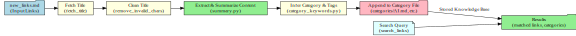
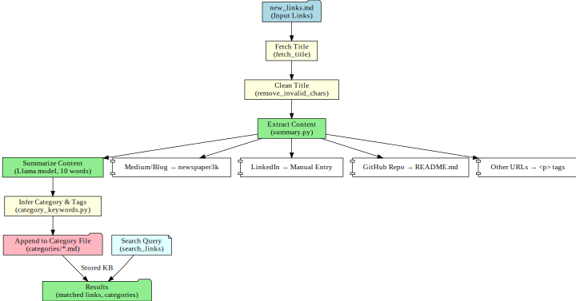

# 🧠 Personal Knowledge Base (PKB) Links Automation

This project is a **Personal Knowledge Base (PKB) Links tool** that automatically collects, summarizes, tags, and organizes links into category-specific Markdown files for easy reference and search.

---

## 🚀 Features
- Fetch titles of links from `new_links.md`
- Extract article/repo/blog content with **robust handling** for:
  - Medium & Blogs (`newspaper3k`)
  - GitHub repos (README extraction)
  - LinkedIn (skipped with warning)
  - Generic websites (paragraph scraping)
- Summarize content using a **local Llama model** with configurable summary length:
  - `short` (~1–2 sentences)
  - `medium` (~2–3 sentences)
  - `long` (~3–5 sentences)
- Categorize links based on **keyword → category + tags mapping**
- Store categorized links into `categories/*.md` with **title, summary, tags, and timestamp**
- Full-text search across **titles, summaries, and tags**
- Logs all activity to `logs/pkb_log.json`

---

## 📂 Project Structure
- **category_keywords.py** → Defines categories and keyword-to-tag mapping  
- **pkb_main.py** → Main script: process links, categorize, store, search  
- **summarizer.py** → Extracts & summarizes content with error handling and logging  
- **requirements.txt** → Python dependencies  

---

## 🛠️ Workflow

### High-Level Workflow


### Detailed Workflow (Content Extraction & Summarization)


---

## ⚙️ Installation

```bash
git clone <repo-url>
cd personal-knowledge-base

# Create virtual environment (recommended)
python -m venv venv
source venv/bin/activate   # On Linux/Mac
venv\Scripts\activate      # On Windows

# Install dependencies
pip install -r requirements.txt


You will also need a **local Llama model server** running with `llama.cpp` exposed at:  
```
http://localhost:12434/engines/llama.cpp/v1/chat/completions
```

---

## ▶️ Usage

1. Add new links to `links/new_links.md`
2. Run the script:
   ```bash
   python pkb_main.py --process --summary-length short
   ```
3. Categorized links with summaries will be saved into `categories/`
4. Search stored links interactively by entering queries

---

## 📌 Example
Input (`links/new_links.md`):
```
https://github.com/oumi-ai/oumi
https://markharrison.io/blog/model-context-protocol
```

Output (`categories/AI.md`):
```
# AI

- [Oumi: Lightweight memory layer](https://github.com/oumi-ai/oumi) : Simple agent memory layer for LLMs - Added on: [2025-09-21]
- [Model Context Protocol](https://markharrison.io/blog/model-context-protocol) : Standard for LLM interoperability and context sharing - Added on: [2025-09-21]
```

---

## 🔍 Search
You can search links across categories:
```python
python pkb_main.py --search "agent"

```
Output:
```
Oumi: Lightweight memory layer (AI): https://github.com/oumi-ai/oumi
Model Context Protocol (AI): https://markharrison.io/blog/model-context-protocol
```

---

## 📝 Notes
- LinkedIn scraping is skipped (manual input required).
- Summarization requires a **locally running Docker Model Runner (DMR) Llama model**.
- Logs are stored in `logs/pkb_log.json`.
- Search works across **titles, summaries, and tags**.
- This project **only to prototype only implementation** with help of AI Assitance.

---

## 📖 License
